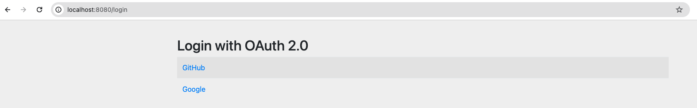
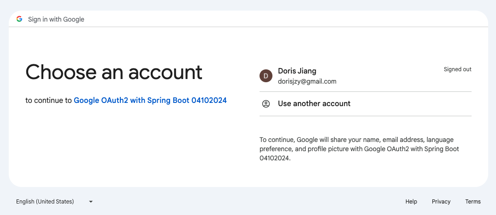
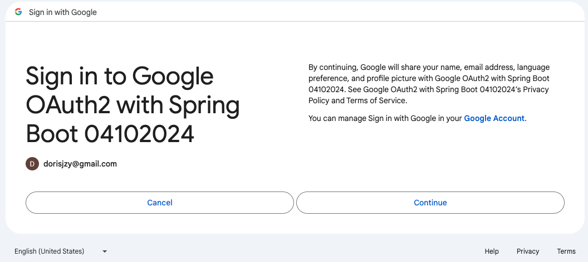
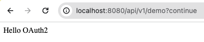
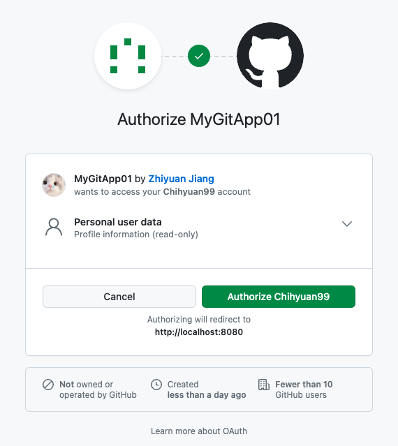

# Spring boot 3.0 with OAuth2 Social Login

A sample project that shows how to implement OAuth2 login using **Github** and **Google** as resource servers

### Application diagram


### OAuth2.0 flow (How things really work in action)


### Steps to create a gitHub application
* Go to [GitHub developer portal](https://github.com/settings/developers)
* Create a new application and provide the required information
  * Set the homepage URL to http://localhost:8080
  * Authorization callback URL to http://localhost:8080/login/oauth2/code/github.

### Update the `application.yml` file
After creating a new application, you will a client ID and a client secret. Copy this two information and paste the in the `application.yml` file

```
spring:
  security:
    oauth2:
      client:
        registration:
          github:
            clientId: github-app-client-id-here
            clientSecret: github-app-client-secret-here
          google:
            clientId: google-app-client-id-here
            clientSecret: google-app-client-secret-here
```

### Start the application and enjoy your Social-login

### DEMO
#### 1. Choose to login with Google Credentials


#### 2. Choose an Google Account


#### 3. Sign in with Google


#### 4. Successfully signed in with Google


#### 5. Sign in with Github
